# Implementation of a three-tier architecture 
Generally most architectures are based on three tiers which are
a. Presentation layer: this is usually the user interface such as the client server or browser
b. Business layer: This is usually the backend program which implements the business logic side of things.
c. Data Access or Management layer: This is the layer for computer data storage and data access. Database Server or file system FTP.

## Creating a Web-Server.
The first step is to create an EC2 instance (Linux DISTR0: Centos8), after this I created 3 volumes of the EBS(elastic block store) and attached it to the EC2 instance => Web Server. 

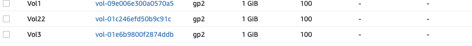

The configuration of the EBS was done through the AWS interface and validate in the console of the web server using the "lsblk" command to inspect what block devices were attached to the server.

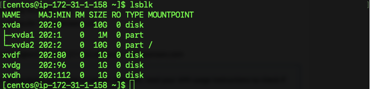

The web server volumes were verified using the command `ls /dev/`
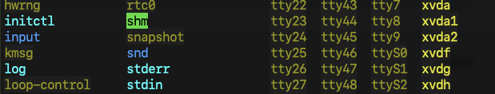

The next step, I took was to use the `df -h` command to see all mounts and free space on the web server. The output is shown below after running this command.

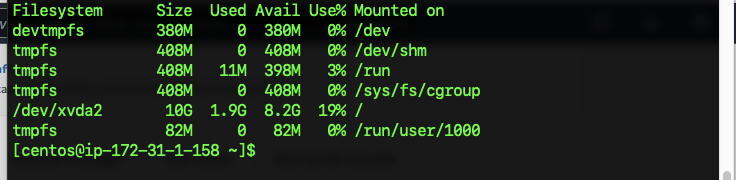

## Creating a Partition for a Web-Server.

The first step to create a partition for Linux distro(Centos 8) is to use this command 

`sudo fdisk /dev/xvdf`. 

This opens a partition interface for creating a partition
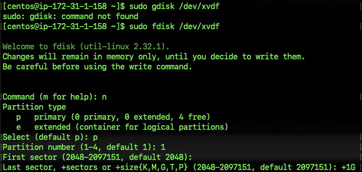

The next command is "p" this shows the information about that particular disk or volume.

To create a new partition , the command "n" was used and this was done for the other 2 volumes that was attached to this particular web server.
The next command is to put p which is the primary

To effect the change the "w" command has to be used. 
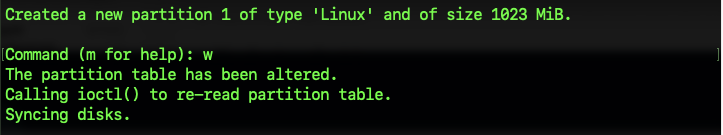

The last step is to use the `lsblk` command to see that the partition has been correctly specified. 
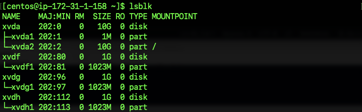

### Creating a Physical Partition for a Web-Server
The next step is to install lvm2 on the web-server using this command
`sudo yum install lvm2` 

`sudo lvmdiskscan` 
`sudo pvcreate /dev/xvdf1 /dev/xvdg1 /dev/xvdh1`

`sudo pvs`

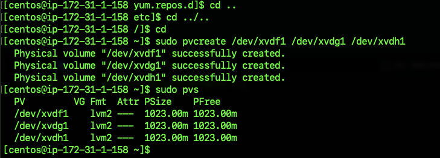

### Creating a Volume group for a Web-Server

After the physical volumes are created, these PV are then added to a volume group(VG). I named the VG : webdata-vg, by running this command.

`sudo vgcreate webdata-vg /dev/xvdf1 /dev/xvdg1 /dev/xvdh1`
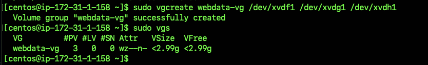

### Creating a Logical volumes for a Web-Server

The next step is to use lvcreate utility to create a two logical volumes such as apps-lv and logs-lv for the remaining space of the pv size.
`sudo lvcreate -n apps-lv -L 1.5G webdata-vg`

`sudo lvcreate -n logs-lv -L 1.5G webdata-vg`

`sudo lvs`

To verify the entire setup
`sudo vgdisplay -v` #view complete setup -VG, PV and LV

`sudo lsblk`

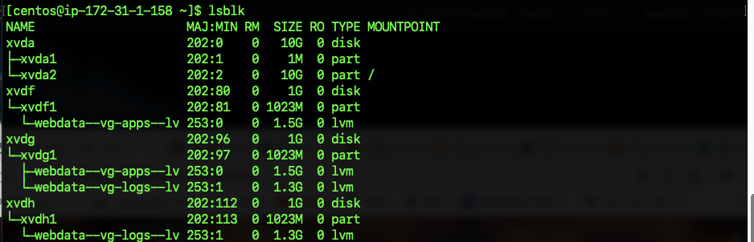

The next step is to create a file system, the ext4 is used to format the logical volumes with ext4 filesystem.

`sudo mkfs -t ext4 /dev/webdata-vg/apps-lv`

`sudo mkfs -t ext4 /dev/webdata-vg/logs-lv`

## Creating directory to store website files for a Web-Server.

The first step is to create a directory using this command.
`sudo mkdir -p /var/www/html`

The next step is to create a recovery directory to store backup of log data
`sudo mkdir -p /home/recovery/logs`

After creating, these directories the next step is to mount directory to apps-lv logical volume using this command.
`sudo mount /dev/webdata-vg/apps-lv /var/www/html`

Before doing, this above command we have to use rsync utility to backup all the files in the log directory /var/log into /home/recovery/logs 

`sudo rsync -av /var/log/. /home/recovery/logs/`

The step is to mount /var/log on logs-lv logical volume. 
`sudo mount /dev/webdata-vg/logs-lv /var/log`

The /etc/fstab file must be update so that the mount configuration will persist after restart of the server.

The next crucial step is to input all the blk-ids to the /etc/fstab in the format in the screenshot below, but first run this command to get all the ids. 
`sudo blkid`

`sudo vi /etc/fstab`

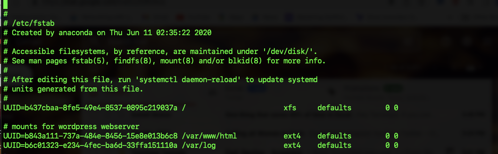

After updating the etc/fstab, we then configure and reload the daemon using the following commands

`sudo mount -a`

`sudo systemctl daemon-reload`

The final step here is to verify the step-up using the command: `df -h`
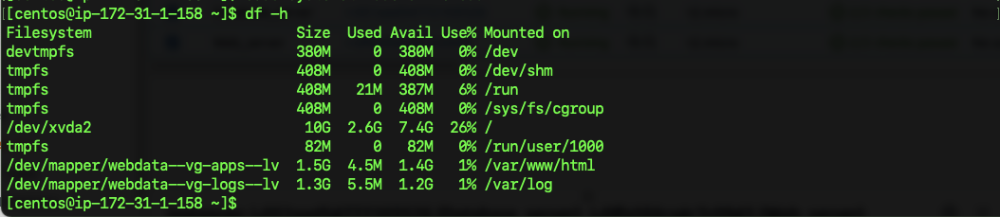

## Creating and configuring the Database.
The configurations done for the web-server was replicated for Database.

NB: There is a directory called /var/db that should be rsync should be applied too

sudo mount /dev/wordpressdb-vg/logs-lv /var/log

## Creating and configuring the Wordpress on Web-server.
1. The first step is to update the repository, using this command:
`sudo yum -y update`

2. Install wget, Apache and its dependencies
`sudo yum -y install wget httpd php php-mysqlnd php-fpm php-json`

3. Start Apache
`sudo systemctl enable httpd`
`sudo systemctl start httpd`

4. To install PHP and it’s dependencies
`sudo yum install https://dl.fedoraproject.org/pub/epel/epel-release-latest-8.noarch.rpm`

`sudo yum install yum-utils http://rpms.remirepo.net/enterprise/remi-release-8.rpm`

`sudo yum module list php`

`sudo yum module reset php`

`sudo yum module enable php:remi-7.4`

`sudo yum install php php-opcache php-gd php-curl php-mysqlnd`

`sudo systemctl start php-fpm`

`sudo systemctl enable php-fpm`

`setsebool -P httpd_execmem 1`

5. Restart Apache
`sudo systemctl restart httpd`

6. Download wordpress and copy wordpress to var/www/html

`mkdir wordpress`

`cd   wordpress`

`sudo wget http://wordpress.org/latest.tar.gz`

`sudo tar xzvf latest.tar.gz`

`sudo rm -rf latest.tar.gz`

`cp wordpress/wp-config-sample.php wordpress/wp-config.php`

`cp -R wordpress /var/www/html/`

7. Configure SELinux Policies
`sudo chown -R apache:apache /var/www/html/wordpress`

`sudo chcon -t httpd_sys_rw_content_t /var/www/html/wordpress -R`

`sudo setsebool -P httpd_can_network_connect=1`

## Creating and configuring the Database Server.
The first step is to install and configure mySQL using the following commands

1. `sudo yum update` 
2. `sudo yum install mysql-server`
3. `sudo systemctl restart mysqld` 
4. `sudo systemctl enable mysqld`

## Configuring the Database to work with WordPress.
sudo mysql
CREATE DATABASE wordpress;
CREATE USER me@172.11.1.128 IDENTIFIED BY 'password@123';
GRANT ALL PRIVILEGES ON *.* TO 'me'@'172.661.1.158';
FLUSH PRIVILEGES;
SHOW DATABASES;
exit

## Configuring the Wordpress to connect to the Database Server.

To allow connection between mySQL and wordpress, I opened port 3306 on the DB server EC2. To ensure that there is extra security, I ensured that I allowed access to the DB server only from the web-server ip address, so that in the inbound rule configuration is specified as /32
1. Install MySQL client and test that you can connect from your Web Server to your DB server by using mysql-client

`sudo yum install mysql`
`sudo mysql -h "172.31.15.158" -u 'me' -p`

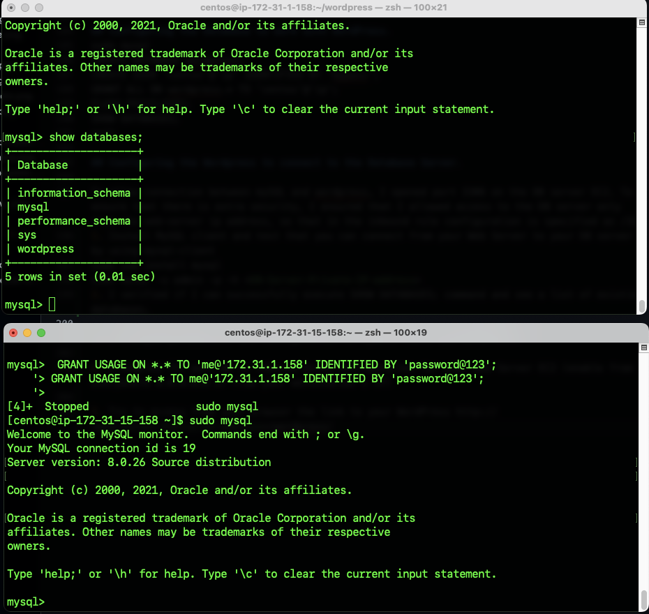

2. I verified if I can successfully execute SHOW DATABASES; command and see a list of existing databases.

3. I changed permissions and configuration so Apache could use WordPress:

- The first step that is required is to edit the config file.
    - cd to the wordpress package you have downloaded,
    - extract the wordpress  tar -xvzf "filename"
    - make a copy of the cp wordpress/wp-config-sample.php wordpress/wp-config.php
    - vi into wordpress/wp-config.php
    - change the database name, user, password into the file.
    - visit this website for configuration https://api.wordpress.org/secret-key/1.1/salt/
    - copy the information, paste and save it into the file
    - cd to the httpd(apache2) go to the "conf" directory 
    - do this "cp httpd.conf httpd.conf.org"
    -

4. I enabled TCP port 80 in Inbound Rules configuration for your Web Server EC2 (enable from everywhere 0.0.0.0/0 or from your workstation’s IP)

5. Try to access from your browser the link to your WordPress http://<Web-Server-Public-IP-Address>/wordpress/