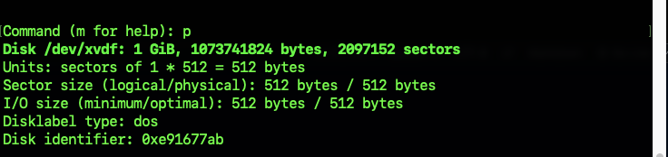

# Implementation of a three-tier architecture 
Generally most architectures are based on three tiers which are
a. Presentation layer: this is usually the user interface such as the client server or browser
b. Business layer: This is usually the backend program which implements the business logic side of things.
c. Data Access or Management layer: This is the layer for computer data storage and data access. Database Server or file system FTP.

## Creating a Web-Server.
The first step is to create an EC2 instance (Linux DISTR0: Centos8), after this I created 3 volumes of the EBS(elastic block store) and attached it to the EC2 instance => Web Server. 

The configuration of the EBS was done through the AWS interface and validate in the console of the web server using the "lsblk" command to inspect what block devices were attached to the server.

The web server volumes were verified using the command `ls /dev/`

The next step, I took was to use the `df -h` command to see all mounts and free space on the web server. The output is shown below after running this command.

## Creating a Partition for a Web-Server.

The first step to create a partition for Linux distro(Centos 8) is to use this command 

`sudo fdisk /dev/xvdf`. 

This opens a partition interface for creating a partition

The next command is "p" this shows the information about that particular disk or volume.

To create a new partition , the command "n" has used and this was done for other 2 volumes that is attached to this particular web server.
